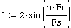
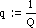

https://www.earlevel.com/main/2003/03/02/the-digital-state-variable-filter/

The frequency control coefficient, f, is defined as



where Fs is the sample rate and Fc is the filter’s corner frequency you want to set. The q coefficient is defined as



where Q normally ranges from 0.5 to inifinity (where the filter oscillates).


The main drawback of the digital state variable is that it becomes unstable at higher frequencies. It depends on the Q setting, but basically the upper bound of stability is about where f reaches 1, which is at one-sixth of the sample rate (8 kHz at 48 kHz). The only way around this is to oversample. A simple way to double the filter’s sample rate (and thereby double the filter’s frequency range) is to run the filter twice with the same input sample, and discard one output sample.


example with double-sampling

```
input  = input buffer;
output = output buffer;
fs     = sampling frequency;
fc     = cutoff frequency normally something like:
         440.0*pow(2.0, (midi_note - 69.0)/12.0);
res    = resonance 0 to 1;
drive  = internal distortion 0 to 0.1
freq   = 2.0*sin(PI*MIN(0.25, fc/(fs*2)));  // the fs*2 is because it's double sampled
damp   = MIN(2.0*(1.0 - pow(res, 0.25)), MIN(2.0, 2.0/freq - freq*0.5));
notch  = notch output
low    = low pass output
high   = high pass output
band   = band pass output
peak   = peaking output = low - high
--
double sampled svf loop:
for (i=0; i<numSamples; i++)
{
  in    = input[i];
  notch = in - damp*band;
  low   = low + freq*band;
  high  = notch - low;
  band  = freq*high + band - drive*band*band*band;
  out   = 0.5*(notch or low or high or band or peak);
  notch = in - damp*band;
  low   = low + freq*band;
  high  = notch - low;
  band  = freq*high + band - drive*band*band*band;
  out  += 0.5*(same out as above);
  output[i] = out;
}
```


Also that could work as it's a voltage-controlled filter
https://www.musicdsp.org/en/latest/Filters/24-moog-vcf.html

```
//Init
cutoff = cutoff freq in Hz
fs = sampling frequency //(e.g. 44100Hz)
res = resonance [0 - 1] //(minimum - maximum)

f = 2 * cutoff / fs; //[0 - 1]
k = 3.6*f - 1.6*f*f -1; //(Empirical tunning)
p = (k+1)*0.5;
scale = e^((1-p)*1.386249;
r = res*scale;
y4 = output;

y1=y2=y3=y4=oldx=oldy1=oldy2=oldy3=0;

//Loop
//--Inverted feed back for corner peaking
x = input - r*y4;

//Four cascaded onepole filters (bilinear transform)
y1=x*p + oldx*p - k*y1;
y2=y1*p+oldy1*p - k*y2;
y3=y2*p+oldy2*p - k*y3;
y4=y3*p+oldy3*p - k*y4;

//Clipper band limited sigmoid
y4 = y4 - (y4^3)/6;

oldx = x;
oldy1 = y1;
oldy2 = y2;
oldy3 = y3;
```


```
#pragma once

namespace DistoCore
{
  template<class T>
  class MoogFilter
  {
  public:
    MoogFilter();
    ~MoogFilter() {};

    T getSampleRate() const { return sampleRate; }
    void setSampleRate(T fs) { sampleRate = fs; calc(); }
    T getResonance() const { return resonance; }
    void setResonance(T filterRezo) { resonance = filterRezo; calc(); }
    T getCutoff() const { return cutoff; }
    T getCutoffHz() const { return cutoff * sampleRate * 0.5; }
    void setCutoff(T filterCutoff) { cutoff = filterCutoff; calc(); }

    void init();
    void calc();
    T process(T input);
    // filter an input sample using normalized params
    T filter(T input, T cutoff, T resonance);

  protected:
    // cutoff and resonance [0 - 1]
    T cutoff;
    T resonance;
    T sampleRate;
    T fs;
    T y1,y2,y3,y4;
    T oldx;
    T oldy1,oldy2,oldy3;
    T x;
    T r;
    T p;
    T k;
  };

    /**
     * Construct Moog-filter.
     */
  template<class T>
  MoogFilter<T>::MoogFilter()
  : sampleRate(T(44100.0))
  , cutoff(T(1.0))
  , resonance(T(0.0))
  {
    init();
  }

    /**
     * Initialize filter buffers.
     */
  template<class T>
  void MoogFilter<T>::init()
  {
    // initialize values
    y1=y2=y3=y4=oldx=oldy1=oldy2=oldy3=T(0.0);
    calc();
  }

    /**
     * Calculate coefficients.
     */
  template<class T>
  void MoogFilter<T>::calc()
  {
    // TODO: replace with your constant
    const double kPi = 3.1415926535897931;

    // empirical tuning
    p = cutoff * (T(1.8) - T(0.8) * cutoff);
    // k = p + p - T(1.0);
    // A much better tuning seems to be:
    k = T(2.0) * sin(cutoff * kPi * T(0.5)) - T(1.0);

    T t1 = (T(1.0) - p) * T(1.386249);
    T t2 = T(12.0) + t1 * t1;
    r = resonance * (t2 + T(6.0) * t1) / (t2 - T(6.0) * t1);
  };

    /**
     * Process single sample.
     */
  template<class T>
  T MoogFilter<T>::process(T input)
  {
    // process input
    x = input - r * y4;

    // four cascaded one-pole filters (bilinear transform)
    y1 =  x * p + oldx  * p - k * y1;
    y2 = y1 * p + oldy1 * p - k * y2;
    y3 = y2 * p + oldy2 * p - k * y3;
    y4 = y3 * p + oldy3 * p - k * y4;

    // clipper band limited sigmoid
    y4 -= (y4 * y4 * y4) / T(6.0);

    oldx = x; oldy1 = y1; oldy2 = y2; oldy3 = y3;

    return y4;
  }

    /**
     * Filter single sample using specified params.
     */
  template<class T>
  T MoogFilter<T>::filter(T input, T filterCutoff, T filterRezo)
  {
    // set params first
    cutoff = filterCutoff;
    resonance = filterRezo;
    calc();

    return process(input);
  }
}
```